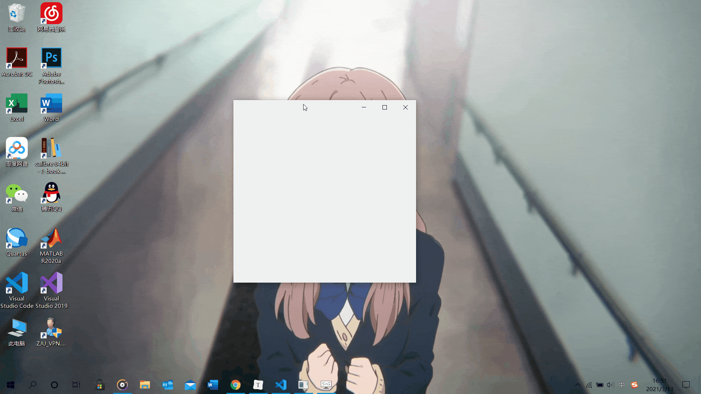

# PyQt Frameless Window
A frameless window based on pyqt5.

## Features
* Move
* Stretching
* Window animation
* Window DWM shadow
* Win10 acrylic blur
* Win11 mica blur
* Win7 Aero blur

## Examples
* Normal frameless window

* Acrylic frameless window


## Blog
[《如何在pyqt中自定义无边框窗口》](https://www.cnblogs.com/zhiyiYo/p/14659981.html)

## Notes
1. `FramelessWindow` provides a custom title bar. If you don't like it, you can rewrite it;
2. The window using the acrylic effect may be stuck when dragging for some Win10 versions. See the blog for solution.

## See also
Here are some projects that use PyQt-Frameless-Window:
* [**zhiyiYo/Groove**: A music player based on PyQt5 and LAV Filters.](https://github.com/zhiyiYo/Groove)
* [**zhiyiYo/Alpha-Gobang-Zero**: A gobang robot based on reinforcement learning.](https://github.com/zhiyiYo/Alpha-Gobang-Zero)
* [**tonquer/picacg-qt**: 哔咔漫画PC客户端.](https://github.com/tonquer/picacg-qt)

## License
```
MIT License

Copyright (c) 2021 Zhengzhi Huang

Permission is hereby granted, free of charge, to any person obtaining a copy
of this software and associated documentation files (the "Software"), to deal
in the Software without restriction, including without limitation the rights
to use, copy, modify, merge, publish, distribute, sublicense, and/or sell
copies of the Software, and to permit persons to whom the Software is
furnished to do so, subject to the following conditions:

The above copyright notice and this permission notice shall be included in all
copies or substantial portions of the Software.

THE SOFTWARE IS PROVIDED "AS IS", WITHOUT WARRANTY OF ANY KIND, EXPRESS OR
IMPLIED, INCLUDING BUT NOT LIMITED TO THE WARRANTIES OF MERCHANTABILITY,
FITNESS FOR A PARTICULAR PURPOSE AND NONINFRINGEMENT. IN NO EVENT SHALL THE
AUTHORS OR COPYRIGHT HOLDERS BE LIABLE FOR ANY CLAIM, DAMAGES OR OTHER
LIABILITY, WHETHER IN AN ACTION OF CONTRACT, TORT OR OTHERWISE, ARISING FROM,
OUT OF OR IN CONNECTION WITH THE SOFTWARE OR THE USE OR OTHER DEALINGS IN THE
SOFTWARE.
```
