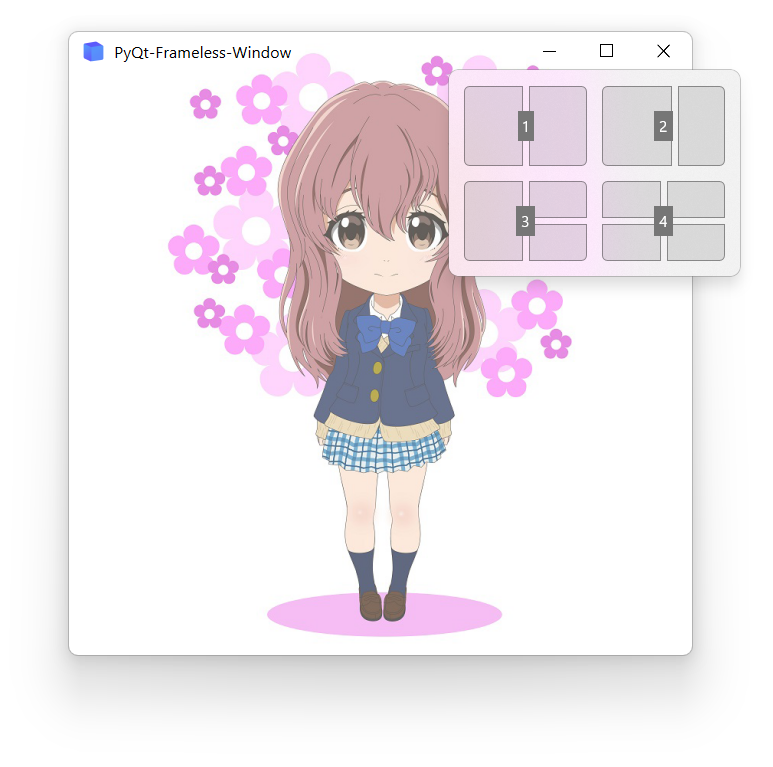
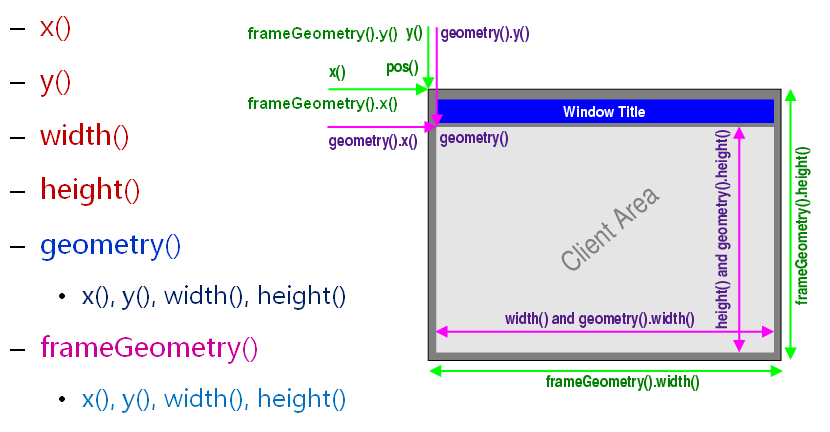

## Snap layout

### Description
Snap layouts are a new Windows 11 feature to help introduce users to the power of window snapping. Snap layouts are easily accessible by hovering the mouse over a window's maximize button or pressing <kbd>Win</kbd> + <kbd>Z</kbd>. After invoking the menu that shows the available layouts, users can click on a zone in a layout to snap a window to that particular zone and then use Snap Assist to finish building an entire layout of windows.


### Implementation
PyQt-Frameless-Window does not enable the snap layout feature by default, because user may change the maximize button in the title bar. Here is an example shows how to enable snap layout when using the default title bar. You should replace `WindowsFramelessWindow.nativeEvent()` in `qframelesswindow/windows/__init__.py` with the following code:
```python
def nativeEvent(self, eventType, message):
    """ Handle the Windows message """
    msg = MSG.from_address(message.__int__())
    if not msg.hWnd:
        return super().nativeEvent(eventType, message)

    if msg.message == win32con.WM_NCHITTEST and self._isResizeEnabled:
        pos = QCursor.pos()
        xPos = pos.x() - self.x()
        yPos = pos.y() - self.y()
        w, h = self.width(), self.height()
        lx = xPos < self.BORDER_WIDTH
        rx = xPos > w - self.BORDER_WIDTH
        ty = yPos < self.BORDER_WIDTH
        by = yPos > h - self.BORDER_WIDTH
        if lx and ty:
            return True, win32con.HTTOPLEFT
        elif rx and by:
            return True, win32con.HTBOTTOMRIGHT
        elif rx and ty:
            return True, win32con.HTTOPRIGHT
        elif lx and by:
            return True, win32con.HTBOTTOMLEFT
        elif ty:
            return True, win32con.HTTOP
        elif by:
            return True, win32con.HTBOTTOM
        elif lx:
            return True, win32con.HTLEFT
        elif rx:
            return True, win32con.HTRIGHT

    #--------------------------------------- ADDED CODE --------------------------------------#
        elif self.titleBar.childAt(pos-self.geometry().topLeft()) is self.titleBar.maxBtn:
            self.titleBar.maxBtn.setState(TitleBarButtonState.HOVER)
            return True, win32con.HTMAXBUTTON
    elif msg.message in [0x2A2, win32con.WM_MOUSELEAVE]:
        self.titleBar.maxBtn.setState(TitleBarButtonState.NORMAL)
    elif msg.message in [win32con.WM_NCLBUTTONDOWN, win32con.WM_NCLBUTTONDBLCLK]:
        QApplication.sendEvent(self.titleBar.maxBtn, QMouseEvent(
            QEvent.MouseButtonPress, QPoint(), Qt.LeftButton, Qt.LeftButton, Qt.NoModifier))
        return True, 0
    elif msg.message in [win32con.WM_NCLBUTTONUP, win32con.WM_NCRBUTTONUP]:
        QApplication.sendEvent(self.titleBar.maxBtn, QMouseEvent(
            QEvent.MouseButtonRelease, QPoint(), Qt.LeftButton, Qt.LeftButton, Qt.NoModifier))
    #------------------------------------------------------------------------------------------#

    elif msg.message == win32con.WM_NCCALCSIZE:
        if msg.wParam:
            rect = cast(msg.lParam, LPNCCALCSIZE_PARAMS).contents.rgrc[0]
        else:
            rect = cast(msg.lParam, LPRECT).contents

        isMax = win_utils.isMaximized(msg.hWnd)
        isFull = win_utils.isFullScreen(msg.hWnd)

        # adjust the size of client rect
        if isMax and not isFull:
            thickness = win_utils.getResizeBorderThickness(msg.hWnd)
            rect.top += thickness
            rect.left += thickness
            rect.right -= thickness
            rect.bottom -= thickness

        # handle the situation that an auto-hide taskbar is enabled
        if (isMax or isFull) and Taskbar.isAutoHide():
            position = Taskbar.getPosition(msg.hWnd)
            if position == Taskbar.LEFT:
                rect.top += Taskbar.AUTO_HIDE_THICKNESS
            elif position == Taskbar.BOTTOM:
                rect.bottom -= Taskbar.AUTO_HIDE_THICKNESS
            elif position == Taskbar.LEFT:
                rect.left += Taskbar.AUTO_HIDE_THICKNESS
            elif position == Taskbar.RIGHT:
                rect.right -= Taskbar.AUTO_HIDE_THICKNESS

        result = 0 if not msg.wParam else win32con.WVR_REDRAW
        return True, result

    return super().nativeEvent(eventType, message)
```

We use `self.titleBar.childAt(pos-self.geometry().topLeft())` rather than `self.titleBar.childAt(xPos, yPos)`, because the size of frameless window will be larger than the screen when the window is maximized.


