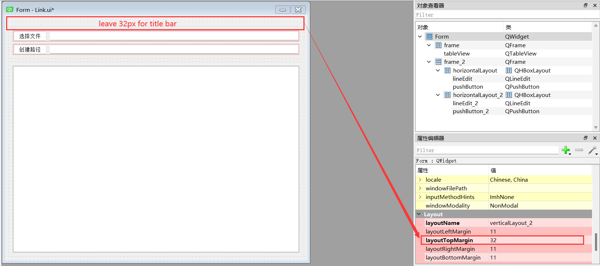

## Usage

### Minimal example
To use the frameless window, we only need to inherit `FramelessWindow` or `FramelessMainWindow`. Here is a minimal example:
```python
import sys

from PyQt5.QtWidgets import QApplication
from qframelesswindow import FramelessWindow


class Window(FramelessWindow):

    def __init__(self, parent=None):
        super().__init__(parent=parent)
        self.setWindowTitle("PyQt-Frameless-Window")
        self.titleBar.raise_()


if __name__ == '__main__':
    app = QApplication(sys.argv)
    demo = Window()
    demo.show()
    sys.exit(app.exec_())
```
For more complex requirements, see [demo.py](https://github.com/zhiyiYo/PyQt-Frameless-Window/blob/master/examples/demo.py) and [main_window.py](https://github.com/zhiyiYo/PyQt-Frameless-Window/blob/master/examples/main_window.py).

### Customize title bar
PyQt-Frameless-Window uses `TitleBar` as the default title bar. `TitleBar` provides the ability to moving window and contains three basic buttons, including minimize button, maximize/restore button and close button. These buttons are inherited from `TitleBarButton`, and we can use `setXXXColor()` or qss to change the style of buttons. Here is an example:
```python
from qframelesswindow import FramelessWindow, TitleBar


class CustomTitleBar(TitleBar):
    """ Custom title bar """

    def __init__(self, parent):
        super().__init__(parent)

        # customize the style of title bar button
        self.minBtn.setHoverColor(Qt.white)
        self.minBtn.setHoverBackgroundColor(QColor(0, 100, 182))
        self.minBtn.setPressedColor(Qt.white)
        self.minBtn.setPressedBackgroundColor(QColor(54, 57, 65))

        # use qss to customize title bar button
        self.maxBtn.setStyleSheet("""
            TitleBarButton {
                qproperty-normalColor: black;
                qproperty-normalBackgroundColor: transparent;
                qproperty-hoverColor: white;
                qproperty-hoverBackgroundColor: rgb(0, 100, 182);
                qproperty-pressedColor: white;
                qproperty-pressedBackgroundColor: rgb(54, 57, 65);
            }
        """)


class Window(FramelessWindow):

    def __init__(self, parent=None):
        super().__init__(parent=parent)
        # change the default title
        self.setTitleBar(CustomTitleBar(self))
```

If we want a title bar with icon and title, just replace `TitleBar` with `StandardTitleBar`.
```python
from qframelesswindow import FramelessWindow, StandardTitleBar


class Window(FramelessWindow):

    def __init__(self, parent=None):
        super().__init__(parent=parent)
        # replace the default title bar with StandardTitleBar
        self.setTitleBar(StandardTitleBar(self))

        self.setWindowIcon(QIcon("screenshot/logo.png"))
        self.setWindowTitle("PyQt-Frameless-Window")

        # don't forget to put the title bar at the top
        self.titleBar.raise_()
```

When the window icon or title changes, the icon and title of `StandardTitleBar` will also change accordingly. However, we can also use `StandardTitleBar.setTitle()` or `StandardTitleBar.setIcon()` to change them manually.

### Work with Qt Designer
To prevent the title bar from being blocked by other parts, we need to leave 32px space for title bar.


After compiling the ui file into a Ui class, we can use the frameless window through multiple inheritance. Here is an example:
```python
class Ui_Form(object):
    def setupUi(self, Form):
        Form.resize(400, 423)
        self.verticalLayout_2 = QVBoxLayout(Form)
        self.verticalLayout_2.setContentsMargins(-1, 32, -1, -1)
        self.frame_2 = QFrame(Form)
        self.verticalLayout = QVBoxLayout(self.frame_2)
        self.horizontalLayout = QHBoxLayout()
        self.pushButton = QPushButton(self.frame_2)
        self.horizontalLayout.addWidget(self.pushButton)
        self.lineEdit = QLineEdit(self.frame_2)
        self.horizontalLayout.addWidget(self.lineEdit)
        self.verticalLayout.addLayout(self.horizontalLayout)
        self.horizontalLayout_2 = QHBoxLayout()
        self.pushButton_2 = QPushButton(self.frame_2)
        self.horizontalLayout_2.addWidget(self.pushButton_2)
        self.lineEdit_2 = QLineEdit(self.frame_2)
        self.horizontalLayout_2.addWidget(self.lineEdit_2)
        self.verticalLayout.addLayout(self.horizontalLayout_2)
        self.verticalLayout_2.addWidget(self.frame_2)
        self.frame = QFrame(Form)
        self.horizontalLayout_3 = QHBoxLayout(self.frame)
        self.tableView = QTableView(self.frame)
        self.horizontalLayout_3.addWidget(self.tableView)
        self.verticalLayout_2.addWidget(self.frame)

        self.retranslateUi(Form)

    def retranslateUi(self, Form):
        _translate = QCoreApplication.translate
        Form.setWindowTitle(_translate("Form", "Form"))
        self.pushButton.setText(_translate("Form", "选择文件"))
        self.pushButton_2.setText(_translate("Form", "创建路径"))


class Window(FramelessWindow, Ui_Form):

    def __init__(self, parent=None):
        super().__init__(parent)
        self.setupUi(self)
```