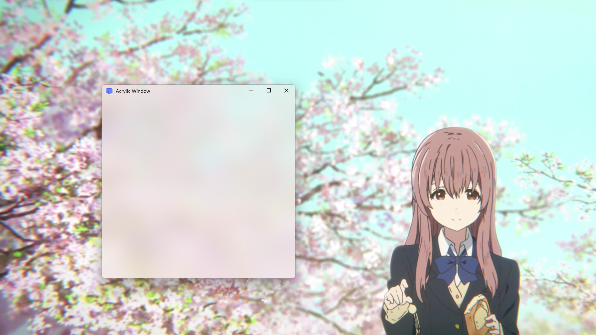

## Window effect

### Acrylic effect
PyQt-Frameless-Window provides the `AcrylicWindow` class, which uses the acrylic blur effect.


Here is an minimal example:
```python
from qframelesswindow import AcrylicWindow


class Window(AcrylicWindow):

    def __init__(self, parent=None):
        super().__init__(parent=parent)
        self.setWindowTitle("Acrylic Window")
        self.titleBar.raise_()

        # customize acrylic effect
        # self.windowEffect.setAcrylicEffect(self.winId(), "106EBE99")

        # you can also enable mica effect on Win11
        # self.windowEffect.setMicaEffect(self.winId(), False)
```

### WindowEffect class
This above example shows that `windowEffect` member controls the window effect. Because moving or resizing the acrylic window on Win10 may get stuck, we can use the following method to toggle acrylic effect:
```python
def setAcrylicEffectEnabled(self, enable: bool):
    """ set acrylic effect enabled """
    self.setStyleSheet(f"background:{'transparent' if enable else '#F2F2F2'}")
    if enable:
        self.windowEffect.setAcrylicEffect(self.winId(), "F2F2F299")
        if QOperatingSystemVersion.current() != QOperatingSystemVersion.Windows10:
            self.windowEffect.addShadowEffect(self.winId())
    else:
        self.windowEffect.addShadowEffect(self.winId())
        self.windowEffect.removeBackgroundEffect(self.winId())
```